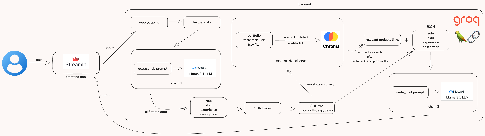

# AI-Powered Cold Email Generator for Job Applications

This project automates the process of generating cold emails tailored to specific job roles by extracting relevant skills and experience from a portfolio and matching them to job descriptions. It leverages the power of language models and similarity searches for precise and contextually aware email generation.

## Features

- **Web Scraping**: Scrapes relevant textual data from job descriptions.
- **Tech Stack Matching**: Uses a vector database to match skills in the job description to the candidate’s experience and past projects.
- **AI-Powered Prompts**: Meta AI’s Llama 3.1 LLM generates personalized emails based on the role, skills, and experience.
- **Streamlit Frontend**: User-friendly interface that allows users to input job links and see generated emails.
- **Chroma for Similarity Search**: Performs similarity searches to find the best match between the job description and the candidate’s skillset.

## Workflow

1. **Input**: Users provide a job link through the Streamlit frontend.
2. **Web Scraping**: The link is processed to extract textual job data.
3. **Tech Stack Extraction**: The extracted job data is processed to identify required skills and experience, which are stored in a CSV file.
4. **Vector Database**: The portfolio's tech stack and job skills are stored in Chroma for a similarity search.
5. **AI Processing**: A JSON file containing the role, skills, and description is fed into Meta AI’s Llama 3.1 LLM, generating a personalized cold email prompt.
6. **Output**: The generated email is displayed on the frontend.

## Tech Stack

- **Frontend**:
  - Streamlit
- **Backend**:
  - Meta AI’s Llama 3.1 LLM
  - ChromaDB for vector database and similarity search
  - Python/Langchain/BeatifulSoup for web scraping and data processing
